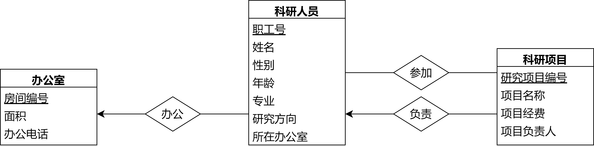
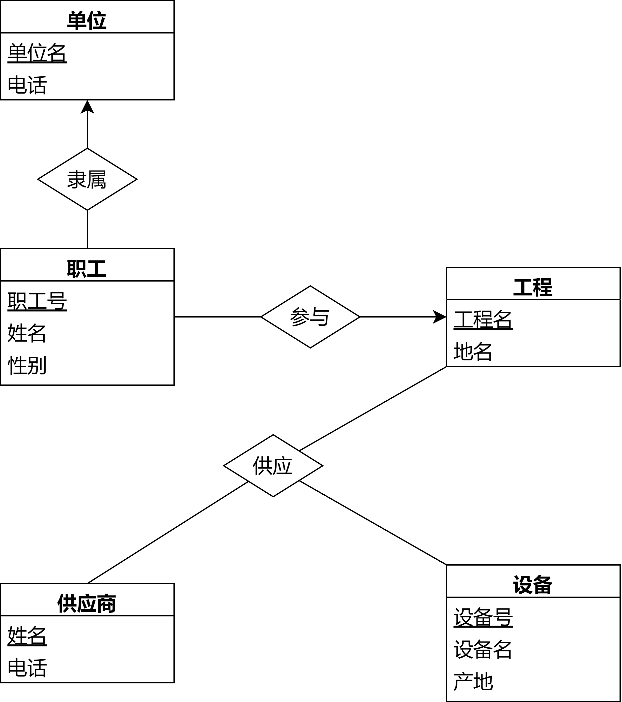

1. 在图书管理数据库中，有如下三个关系：
   图书信息关系：B(B#, BNAME, AUTHOR, TYPE)，其中B#为图书编号，BNAME为书名，AUTHOR为作者，TYPE为类别，主键为B#；
   学⽣信息关系：S(S#, SNAME, CLASS)，其中S#为学号，SNAME为学⽣姓名，CLASS为班级号，主键为S#；
   借阅信息关系：L(S#, B#, DATE)，其中S#为借阅⼈学号，B#为被借阅图书编号，DATE为借阅日期，主键为{S#, B#}。
   使用SQL语言回答以下问题：
   （1）删除“《西游记》”这本书的所有借阅信息
   （2）查询“201”班学⽣借阅图书的书名
   （3）查询“⼩明”借过，但“⼩李”没有借过的图书的编号
   （4）查询被借阅过的每本书的图书编号和借阅次数。

(1)

```sql
DELETE
FROM L
WHERE L.B# IN (
	SELECT B.B#
    FROM B
    WHERE BNAME = '《西游记》'
);
```

(2)

```sql
SELECT BNAME
FROM B, L, S
WHERE B.B# = L.B# and S.S# = L.S# and CLASS='201';
```

(3)

```sql
(SELECT B#
FROM L, S
WHERE L.S# = S.S# and SNAME = '小明')
EXCEPT
(SELECT B#
FROM L, S
WHERE L.S# = S.S# and SNAME = '小李');
```

(4)
```sql
SELECT B#, COUNT(*)
FROM L
GROUP BY B#;
```


2. 在学⽣成绩数据库中，有如下三个关系：
   学⽣信息关系：S(S#, SNAME, D#)，其中S#为学号，SNAME为学⽣姓名，D#为所在系名，主键为S#；
   学⽣成绩关系：SC(S#, C#, Grade)，其中S#为学号，C#为课程号，Grade为成绩，主键为{S#, C#}；
   系信息关系：D(D#, Addr)，其中D#为系名，Addr为所在地址，主键为D#。
   使⽤SQL语言回答以下问题：
   （1）查询“物理系”的全体学⽣，按学号升序排列
   （2）查询姓王的学生的学号和姓名
   （3）定义一个视图 Sum(S#, SNAME, Count)，其中S#为学号，SNAME为学生姓名，Count为该学生的选课课程个数。
   （4）查询既选修了“1002”课程的学⽣中选修了“1003”课程的学⽣姓名

(1)
```sql
SELECT S#, SNAME
FROM S
WHERE D# = '物理系'
ORDER BY S# ASC;
```

(2)

```sql
SELECT S#, SNAME
FROM S
WHERE SNAME LIKE '王%';
```

(3)
```sql
CREATE VIEW Sum(S#, SNAME, Count) AS
SELECT S.S#, SNAME, COUNT(DISTINCT C#)
FROM S, SC
WHERE S.S# = SC.S#
GROUP BY S.S#;
```

(4)
```sql
(SELECT SNAME
FROM S, SC
WHERE S.S# = SC.S# and C# = 1002)
INTERSECT
(SELECT SNAME
FROM S, SC
WHERE S.S# = SC.S# and C# = 1003);
```


3. 在第2题学生成绩数据库中，若S关系中有学生选课，则SC关系中有该学生的S#和C#记录，否则没有，则使⽤SQL语言回答以下问题：
   （1）查询选过课的学⽣的学号和姓名
   （2）查询没选过课的学生学号和姓名

(1)
```sql
SELECT DISTINCT S.S#, SNAME
FROM S, SC
WHERE S.S# = SC.S#;
```

(2)
```sql
(SELECT S.S#, SNAME
FROM S)
EXCEPT
(SELECT DISTINCT S.S#, SNAME
FROM S, SC
WHERE S.S# = SC.S#);
```


4. 设有如下实体：
   科研人员：职工号、姓名、性别、年龄、专业、研究方向、所在办公室
   科研项目：研究项目编号、项目名称、项目经费、项目负责人
   办公室：房间编号、面积、办公电话
   上述实体存在如下联系：
   1）一个科研项目可以有多名研究人员参加，一个研究人员也可以参加多个研究项目
   2）每个项目由一个科研人员担任负责人
   3）一个办公室可以有多个科研人员办公，而一个科研人员只能在一个办公室里办公
   设计该系统的 ER 图，并写出对应的关系模式，标明主键

系统的ER图如下：



关系模式：

- 科研人员Staff(<u>职工号</u>, 姓名, 性别, 年龄, 专业, 研究方向, 所在办公室)
- 科研项目Project(<u>研究项目编号</u>, 项目名称, 项目经费, 项目负责人)
- 办公室Office(<u>房间编号</u>, 面积, 办公电话)
- 参加Engage(<u>职工号</u>, <u>研究项目编号</u>)


5. 设有如下实体：
   单位：单位名、电话
   职工：职工号、姓名、性别
   设备：设备号、设备名、产地
   供应商：姓名、电话
   工程：工程名、地名
   上述实体存在如下联系：
   1）一个单位有多个职工，一个职工只隶属于一个单位
   2）一个职工只参与一个工程，一个工程中有多个职工参加工作
   3）有多个供应商为各个工程供应不同的设备
   试完成如下工作：
   1）设计该 E-R 图；
   2）将该 E-R 图转换为等价的关系模式表示的数据库逻辑结构。

1）E-R图如下：



2）E-R图等价的关系模式表示的数据库逻辑结构：

- 单位Unit(<u>单位名</u>, 电话)
- 职工Staff(<u>职工号</u>, 姓名, 性别, 单位名, 工程名)
- 设备Device(<u>设备号</u>, 设备名, 产地)
- 供应商Supplier(<u>姓名</u>, 电话)
- 工程Project(<u>工程名</u>, 地名)
- 供应Supply(<u>设备号</u>, <u>工程名</u>, <u>供应商姓名</u>)
