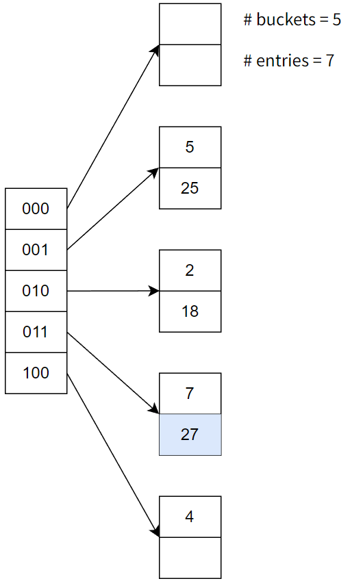

# 作业四

一、设有关系模式 $R(A,B,C,D,E,H)$，$R$ 的函数依赖关系为 $F=\{B\to C, E\to D, D\to A, AC\to D, DC\to B\}$

1. 求 $(DC)^+_F$
2. 求 $R$ 的候选码
3. 判断 $R$ 属于第几范式
4. 保持无损连接性和函数依赖，将 $R$ 分解成 3NF

**答：**

1. $X^{(1)}=\{DC\}\cup\{AB\}=\{ABCD\}$，$X^{(2)}=X^{(1)}$，故 $(DC)^+_F=\{ABCD\}$。
2. E 是 L 类属性，H 是 N 类属性，ABCD 是 LR 类属性，$(EH)^+_F=\{EDAH\}\ne U$，加入 B 后，$(EBH)^+_F=\{EDAHBC\}$，且 EBH 的任意一个真子集都不是 $R$ 的超码，所以 EBH 是一个候选码。同理，可以验证，ECH 也是一个候选码。
3. 由 $E\to D$ 可知，非键属性 D 部分函数依赖于候选码 EBH，所以 $R$ 不是第二范式，则 $R$ 为第一范式。
4. $F$ 的极小函数依赖集仍为 $F=\{B\to C, E\to D, D\to A, AC\to D, DC\to B\}$，将其保持函数依赖分解，得到 $\rho=\{H, BC, ED, DA, ACD, DCB\}$，构造分解 $\tau=\{H, BC, ED, DA, ACD, DCB, EBH\}$，其中 EBH 为 $R$ 的一个候选码，则 $\tau$ 为 $R$ 的一个保持无损连接性和函数依赖的分解。

二、设有关系模式 $R(A,B,C,D,G)$，$R$ 的函数依赖关系为 $F=\{AC\to B,C\to D,AC\to G,B\to C\}$

1. 求 $(AC)^+_F$
2. 求 $R$ 的候选码
3. 判断 $R$ 属于第几范式
4. 保持无损连接性和函数依赖，将 $R$ 分解成 3NF

**答：**

1. $X^{(1)}=\{DC\}\cup\{BDG\}=\{ABCDG\}=U$，故 $(AC)^+_F=\{ABCDG\}$。
2. A 是 L 类属性，DG 是 R 类属性，BC 是 LR 类属性，$(A)^+_F=\{A\}\ne U$，加入 C 后，$(AC)^+_F=\{ABCDG\}$，且 AC 的任意一个真子集都不是 $R$ 的超码，所以 AC 是一个候选码。同理，可以验证，AB 也是一个候选码。
3. 由 $C\to D$ 可知，非键属性 D 部分函数依赖于候选码 AC，所以 $R$ 不是第二范式，则 $R$ 为第一范式。
4. $F$ 的极小函数依赖集仍为 $F=\{AC\to B,C\to D,AC\to G,B\to C\}$，将其保持函数依赖分解，得到 $\rho=\{ACB, CD, ACG, BC\}$，由于 ACB 包含候选码 AC，所以 $\rho$ 为 $R$ 的一个保持无损连接性和函数依赖的分解。

三、求 $F$ 的最小依赖集
$F=\{AB\to C,D\to EG,C\to A, BE\to C, BC\to D,CG\to BD, ACD\to B, CE\to AG\}$

**答：**

1. 分解函数依赖：$D\to EG$ 变为 $D\to E$ 和 $D\to G$，$CG\to BD$ 变为 $CG\to B$ 和 $CG\to D$，$CE\to AG$ 变为 $CE\to A$ 和 $CE\to G$，得到
   $F_1=\{AB\to C, D\to E, D\to G, C\to A, BE\to C, BC\to D, CG\to B, CG\to D, ACD\to B, CE\to A, CE\to G\}$

1. 删除函数依赖的左部的冗余：$ACD\to B$ 变为 $CD\to B$，$CE\to A$ 变为 $C\to A$（重复元素，删去），得到
   $F_2=\{AB\to C, D\to E, D\to G, C\to A, BE\to C, BC\to D, CG\to B, CG\to D, CD\to B, CE\to G\}$
2. 删除冗余函数依赖：删除 $CG\to D$，$CD\to B$，得到
   $F_m=\{AB\to C, D\to E, D\to G, C\to A, BE\to C, BC\to D, CG\to B, CE\to G\}$ 

四、有一个商店信息表：
Shop(SNo, INo, INum, DNo, DName)
表中各属性的含义为：

| SNo      | INo      | INum         | DNo      | DName      |
| :------- | :------- | :----------- | :------- | :--------- |
| 商店编号 | 商品编号 | 商品库存信息 | 部门编号 | 部门负责人 |

这些数据有如下的语义：

- 每个商店的每种商品只在该商店的一个部门销售
- 每个商店的每个部门只有一个部门负责人
- 每个商店的每种商品只有一个库存数量

(1) 根据上述语义写出关系 Shop 的函数依赖
(2) 找出关系 Shop 的候选码
(3) 判断关系 Shop 所达到的最高范式等级
(4) 如果关系 Shop 不属于 3NF，将 Shop 分解为具有无损连接性和保持函数依赖的 3NF

**答：**

(1) 函数依赖：$F=\rm{\{(SNo, INo)\to DNo,\ (SNo,DNo)\to DName,\ (SNo, INo)\to INum\}}$

(2) SNo、INo 是 L 类属性，DName、INum 是 R 类属性，DNo 是 LR 类属性，$({\rm SNo, INo})^+_F=\{\rm SNo, INo, DNo, DName, INum\}=U$，所以 (SNo, INo) 是候选码。

(3) Shop 满足第一范式，因为其每个属性的值域都是不可分的简单数据项的集合；
Shop 满足第二范式，因为其中每一个非键属性都完全函数依赖于 Shop 的候选码 (SNo, INo)；
Shop 不满足第三范式，因为存在非键属性 DName，传递地依赖于候选码 (SNo, INo)，如下：
$\rm (SNo, INo)\to (SNo, DNo),\ (SNo, DNo)\to DName$。
综上，Shop 所达到的最高范式等级为第二范式。

(4) $F$ 的极小函数依赖集仍为 $F=\rm{\{(SNo, INo)\to DNo,\ (SNo,DNo)\to DName,\ (SNo, INo)\to INum\}}$，将其保持函数依赖分解，得到 $\rho=\{\rm (SNo, INo, DNo), (SNo, DNo, DName), (SNo, INo, INum)\}$，由于 (SNo, INo, DNo) 包含候选码 (SNo, INo)，则 $\rho$ 为 Shop 的一个具有无损连接性和保持函数依赖的 3NF。

五、利用线性 hash 方法对以下记录进行 hash 存储，在初始 hash 表中加入以下数字：

18, 25, 27, 36, 48, 56, 61

请画出添加以上所有元素后，最终的索引结构以及关键步骤（进行桶的线性增长时）的索引结构。
注：线性 hash 表中最多容纳 $nb\theta$ 个记录，$b=2$，$\theta=0.85$；初始哈希桶结构为下图。 

**答：**

最终的索引结构如下：

关键步骤的索引结构如下：
(1) 插入 25 后，桶发生线性增长

(2) 插入 27 后，桶发生线性增长

(3) 插入 48 后，桶发生线性增长

(4) 插入 61 后，桶发生线性增长

六、已知一棵 B+ 树，如图 1 所示
(1) 请画出在图 1 中插入 23 后所得的新的 B+ 树。
(2) 请画出在图 1 中删除 39 后所得的新的 B+ 树。

**答：**

(1)

(2)

七、用下面的码集合建立一棵 B+ 树：(2, 3, 5, 7, 11, 17, 19, 23, 29, 31)，假设树初始为空
(1) 按照升序添加这些值，阶数为 3。
(2) 按照降序添加这些值，阶数为 3，对比与 (1) 中构造的树是否相同。

**答：**

(1)

(2)

按降序添加值建立的树与 (1) 中构造的树不同，按降序建立的树使用的节点数更少，更为紧凑。
