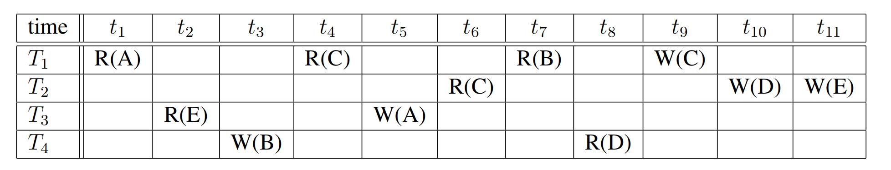
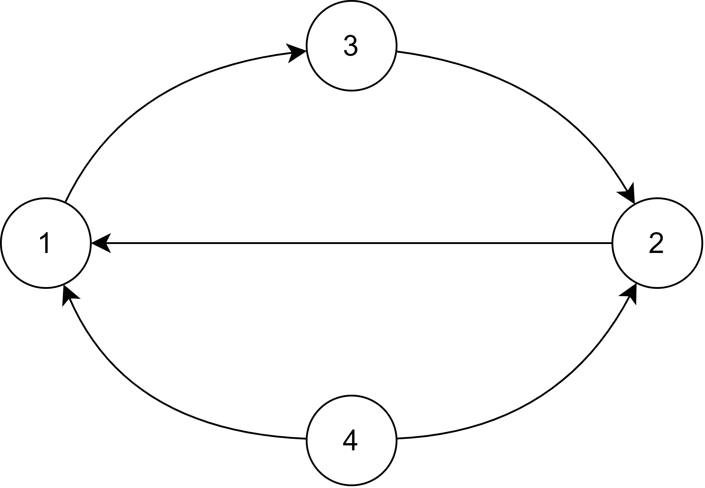
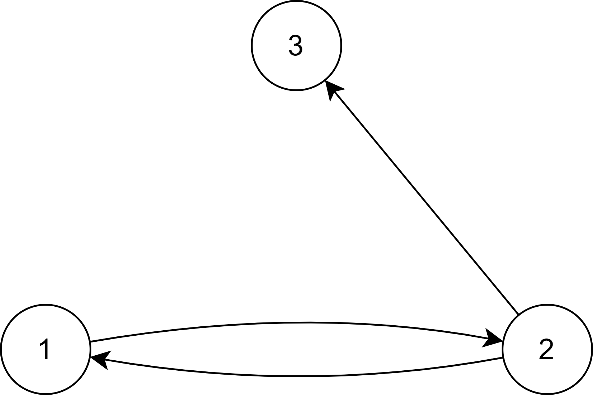
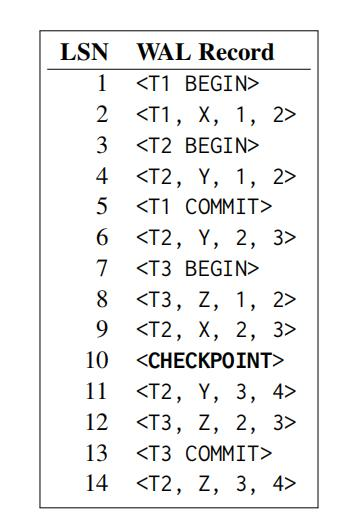
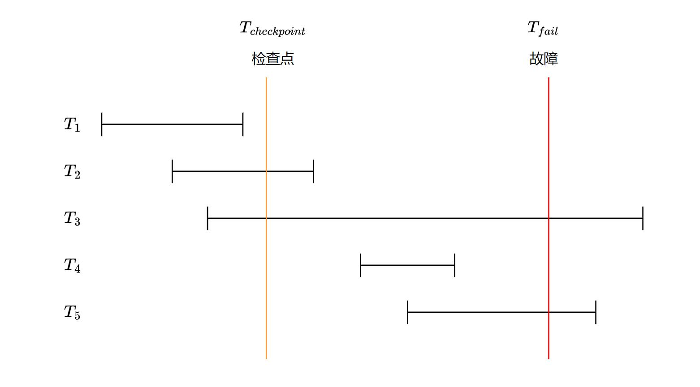

# 作业六

一、考虑下面表中给出了 DBMS 对某四个事务操作五个数据项的调度按时间分布的表，其中 
R(X) 和 W(X) 分别代表对数据项 X 的“读”和“写”，T~i~ 表示事务 i，t~n~ 表示第 n 个时刻，请阅读下表，并回答以下几个问题：



1.1 这是否是一个串行的调度？
1.2 请仿照课上幻灯片中的画法，画出上表中所示事务的优先图（请在箭头上标明事务操作的数据项)。
1.3 根据你画出的事务优先图，该调度是否是个冲突可串行的调度？

**答：**

**1.1** 这不是一个串行的调度。串行调度要求若一个事务的某个动作在另一个事务的某个动作之前，则该事务的所有动作都在另一个事务的所有动作之前。在上表中，T~1~ 的 R(A) 在 T~2~ 的 R(C) 之前，但 T~1~ 的 R(B) 却在 T~2~ 的 R(C) 之后，因此不是一个串行的调度。

**1.2** 根据上表，有 T~1~ < T~3~，T~3~ < T~2~，T~4~ < T~1~，T~2~ < T~1~，T~4~ < T~2~，绘制优先图如下：



**1.3** 观察事务优先图，发现存在环 T1-T3-T2-T1，因此该调度不是一个冲突可串行的调度。


二、设 ri(X)与 wi(X)分别表示事物 Ti 读、写数据单元 X，则一个并发调度可以抽象为读、写串。基于上述表示，画出优先图，并判断下面两个并发调度是否是可串行化的，为什么？
调度 S~1~：r~2~(A); r~1~(B); w~2~(A); r~2~(B); r~3~(A); w~1~(B); w~3~(A); w~2~(B)
调度 S~2~：r~2~(A); r~1~(B); w~2~(A); r~3~(A); w~1~(B); w~3~(A); r~2~(B); w~2~(B)

**答：**

画出调度 S~1~ 的优先图如下：



因为其中存在环 T~1~-T~2~-T~1~，所以 S~1~ 不是可串行化的。

画出调度 S~2~ 的优先图如下：


因为其中无环，所以 S~2~ 是可串行化的。


三、假设我校淘乐果园水果店架设了一套数据库系统，同学在超市挑选好商品后，带商品到结算处结算付款，结算处有多名收银员使用多台机器进行结算。收银员负责扫同学购买水果的种类和数量，由系统后台结算程序计算出同学购买商品的总金额，修改商品表的水果库存量，并将销售信息写入销售表。请根据上述描述，回答以下问题。
假设有两位同学同时购买同一种类的水果，结算事务修改该水果的库存量（记为数据项）所产生的部分调度如下表所示：

| T1            | T2            |
| ------------- | ------------- |
| *a ← Read(X)* |               |
|               | *a ← Read(X)* |
| *a = a - 1*   |               |
| *Write(X, a)* |               |
|               | *a = a - 2*   |
|               | *Write(X, a)* |

3.1 如果数据项 X 购买前的初值为 114514，则上述调度执行完成后，X 的值是多少？这属于哪一类不一致性？
3.2 引入独占锁指令 lock() 和解锁指令 Unlock()，对“问题 1”中存在并发调度进行重写，要求满足两段锁协议，且事务 T1、T2 首条指令的相对请求时间与“问题 1”中的相同。

**答：**

**3.1** T1 读入 a=114514，T2 读入 a=114514，然后 T1 将 a 减 1 后写入，T2 将 a 减 2 后写入，因此上述调度执行完成后，X 的值为 114512。此不一致性属于脏写，因为 T1 和 T2 读入同一数据并修改，T2 写入的结果覆盖了 T1 写入的结果，导致 T1 的写入丢失。

**3.2** 重写结果如下：

| T1            | T2            |
| ------------- | ------------- |
| *lock(X)*     |               |
| *a ← Read(X)* |               |
| *a = a - 1*   |               |
| *Write(X, a)* |               |
| *Unlock(X)*   |               |
|               | *lock(X)*     |
|               | *a ← Read(X)* |
|               | *a = a - 2*   |
|               | *Write(X, a)* |
|               | *Unlock(X)*   |

对应地，两事务的伪代码如下：

```
T1:
lock(X)
a := Read(X)
a := a - 1
Write(X, a)
Unlock(X)

T2:
lock(X)
a := Read(X)
a := a - 2
Write(X, a)
Unlock(X)
```


四、已知某数据库采用即时更新方法（undo-redo 方法）记录 WAL 日志。设故障发生时 WAL 日志文件内容如下：

```
<T1, begin>
<T1, A, 114, 114514>
<T2, begin>
<T1, B, “hit”, “hitcs”>
<T1, commit>
<T3, begin>
<T3, B, “hitcs”, “hitcsdb”>
<T2, A, 114514, 1919810>
```

当系统重启后，DBMS 基于该 WAL 日志文件进行故障恢复。回答下列问题：
4.1 该数据库系统的的日志恢复策略为 Undo/Redo 型，那么其对应的缓冲区处理策略是什么（Steal？No Steal + Force？No Force）？该策略的每一项的具体内容都有什么？
4.2 .当 DBMS 进行故障恢复时，需要对哪些事务进行 undo？对哪些事务进行 redo？给出具体理由。
4.3 当故障恢复完成时，对象 A 和 B 的值分别是什么？描述故障恢复的具体过程。

**答：**

**4.1** 对应的缓冲区处理策略是 Steal + No Force。Steal 表示在事务提交之前，允许将脏页（即已被修改但未提交的页）从缓冲区写回磁盘；No Force 表示在事务提交时，不强制将所有修改过的页从缓冲区写回磁盘。该缓冲区处理策略可以配合 Undo/Redo 型日志恢复策略使用，因为  Steal 策略下磁盘可能包含未提交的数据，undo 日志可供事务进行回滚；No Force 策略下故障发生时，磁盘可能不包含已提交的数据，因此需要 redo 日志以供重做。

**4.2** 需要对 T2、T3 执行 undo，对 T1 执行 redo。
故障恢复时，从后向前扫描日志记录，日志中有 <T3, begin> 和 <T2, begin> 记录，但没有 <T3, commit> 和 <T2, commit>，因此需要对 T2 和 T3 执行 undo。日志中有 <T1, begin> 和 <T1, commit> 记录，因此需要对 T1 执行 redo。

**4.3** 故障恢复完成时，A 的值为 114514，B 的值为 “hitcs”。故障恢复的具体过程如下：
先对 T2 和 T3 执行 undo，即根据记录 <T2, A, 114514, 1919810> 将 A 恢复为 114514，并写 <T2, abort> 记录；根据记录 <T3, B, “hitcs”, “hitcsdb”> 将 B 恢复为 “hitcs”，然后写 <T3, abort> 记录。最后对 T1 执行 redo，根据记录 <T1, B, “hit”, “hitcs”> 将 B改为 “hitcs”，根据记录 <T1, A, 114, 114514> 将 A 改为 114514。


五、当前有一个支持故障恢复技术的 DBMS，其采用了 STEAL 和 NO-FORCE 缓冲区策略，假设每当 DBMS 执行检查点时会将数据缓冲区里面所有的脏数据块写入相应的数据文件，保证数据库的一致性。
以下是数据库发生故障后的一份 WAL 日志，请阅读该日志并回答以下几个问题，其中 <T~i~, X, A, B> 分别代表着事务，数据项，更新前数据项的值，更新后数据项的值。



5.1 请问 DBMS 需要进行恢复数据的时候，数据库的磁盘文件上数据项 X Y Z 的值分别是多少？
5.2 在对该 WAL 日志进行故障恢复的时候，事务 T~1~, T~2~, T~3~ 都应如何处理？请详述该过程与原因。
5.3 假设恢复作业完成后，DBMS 会将所有的数据写入磁盘， DBMS 从 WAL 恢复数据库状态后数据库磁盘中数据项 X、Y、Z 的值分别是多少？

**答：**

**5.1** 执行检查点时将脏数据块写入磁盘，又因为 DBMS 采用 STEAL 和 NO-FORCE 缓冲区策略，因此需要恢复数据时 X 的值为 3，Y 的值为3，Z 的值为 2。

**5.2** T1 无需处理，T2 需要 undo，T3 需要 redo。
故障恢复时，首先找到最后一条检查点记录 \<CHECKPOINT\>，对于此记录前已经 commit 的事务 T1，无需进行任何操作；对于系统故障前未 commit 的事务 T2，需要执行 undo 操作，即将 Z 的值恢复为 3， Y 的值恢复为 3，并写入一条 <T2, abort> 记录；对于系统故障前已经 commit 的事务 T3，需要执行 redo 操作，即将 Z 的值改为 3。

**5.3** X 的值为 2，Y 的值为 1，Z 的值为 3。
对 T2 执行 undo 操作，将 X 恢复为 2，Y 恢复为 1，Z 恢复为 3。对 T3 执行 redo 操作，将 Z 改为 3。


六、使用检查点的数据库恢复系统将根据事务的状态和检查点的关系采取相对应的恢复策略，现在有事务 T~1~-T~5~ 其执行过程如下图所示（线段左端和右端分别表示事务开始与提交），其执行过程中数据库系统发生如图所示的故障，请回答下列问题：



6.1  请问在故障恢复时事务 T~1~-T~5~哪些需要撤销，哪些需要重做，哪些不需要操作？
6.2  事务 T~6~-T~8~ 的日志文件如下图所示，<T~i~，begin> 表示事务 T~i~ 开始执行，<T~i~，commit> 表示事务 T~i~ 提交，<T~i~，D，V~1~，V~2~> 表示事务 T~i~ 将数据项 D 的值由 V~1~ 修改为 V~2~，\<crash\> 表示数据库发生故障。

```
<T6, begin>
<T6, X, 100, 1>
<T7, begin>
<T7, X, 1, 3>
<T8, begin>
<T7, Y, 50, 6>
<T8, Y, 6, 8>
<T8, Z, 10, 9>
<checkpoint>
<T6,commit>
<T8, Z, 9, 10>
<crash>
```

数据库系统发生故障时，请给出恢复子系统时需要 undo 的事务列表和需要 redo 的事务列表。
6.3 请简述事务 T~6~-T~8~ 在系统故障后，基于检查点的故障恢复过程。

**答：**

**6.1** T~3~ 和 T~5~ 在发生故障时尚未完成，所以需要撤销；
T2 和 T4 在检查点与故障之间提交，它们对数据库所作的修改在故障发生时可能还在缓冲区中，尚未写入数据库，所以需要重做；
T1 在检查点之前已经提交，所以不需要操作。

**6.2** 需要 undo 的事务列表为 T~7~、T~8~，需要 redo 的事务列表为 T~6~。

**6.3** 系统检查日志以找到最后一条检查点记录，对检查点之前提交的事务，不作任何处理。对检查点后未提交的事务 T~7~、T~8~，需要执行 undo，即将 Z 恢复为10，Y 恢复为 50，X 恢复为 1，并写入 <T8, abort> 和 <T7, abort> 记录。对检查点后已提交的事务 T~6~，需要执行 redo，即将 X 改为 1。
